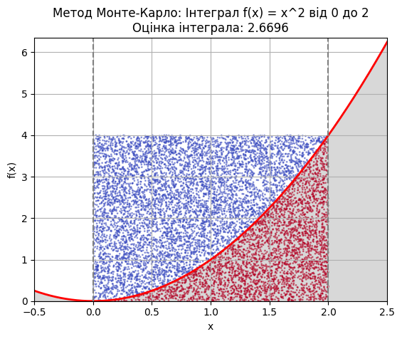

# goit-algo-hw-10
Repository for the homework solution from the GoIT course 'Basic Algorithms and Data Structures', HW-10.

## Завдання 1 : Оптимізація виробництва напоїв із використанням PuLP

Для вирішення завдання оптимізації виробництва "Лимонаду" та "Фруктового соку" з урахуванням обмежень на ресурси ми використаємо лінійне програмування (LP) з бібліотекою PuLP у Python. Завдання полягає у максимізації виробництва напоїв, враховуючи доступні обсяги ресурсів.

### Умови завдання:
- **Ресурси:**
  - "Вода": 100 од.
  - "Цукор": 50 од.
  - "Лимонний сік": 30 од.
  - "Фруктове пюре": 40 од.

- **Потреби для виробництва:**
  - **Лимонад:**
    - 2 од. "Води"
    - 1 од. "Цукру"
    - 1 од. "Лимонного соку"
  - **Фруктовий сік:**
    - 2 од. "Фруктового пюре"
    - 1 од. "Води"

### Модель лінійного програмування

1. **Змінні рішення:**
   - `L`: кількість одиниць "Лимонаду", що потрібно виробити.
   - `F`: кількість одиниць "Фруктового соку", що потрібно виробити.

2. **Мета:**
   - Максимізація загальної кількості вироблених одиниць продукту (L + F).

3. **Обмеження:**
   - Обмеження на кількість "Води": `2L + 1F ≤ 100`
   - Обмеження на кількість "Цукру": `1L ≤ 50`
   - Обмеження на кількість "Лимонного соку": `1L ≤ 30`
   - Обмеження на кількість "Фруктового пюре": `2F ≤ 40`

### Реалізація на Python з використанням PuLP

```python
from pulp import LpMaximize, LpProblem, LpVariable, value

# Ініціалізація проблеми
model = LpProblem(name="maximize_drinks_production", sense=LpMaximize)

# Змінні рішення
L = LpVariable(name="Lemonade", lowBound=0, cat="Continuous")
F = LpVariable(name="Fruit_Juice", lowBound=0, cat="Continuous")

# Функція цілі
model += L + F, "Total Production"

# Обмеження
model += (2 * L + 1 * F <= 100), "Water_Constraint"
model += (1 * L <= 50), "Sugar_Constraint"
model += (1 * L <= 30), "Lemon_Juice_Constraint"
model += (2 * F <= 40), "Fruit_Puree_Constraint"

# Розв'язання задачі
model.solve()

# Виведення результатів
lemonade_production = value(L)
fruit_juice_production = value(F)
total_production = lemonade_production + fruit_juice_production

print(f"Кількість виробленого Лимонаду: {int(lemonade_production)}")
print(f"Кількість виробленого Фруктового соку: {int(fruit_juice_production)}")
print(f"Загальна кількість вироблених напоїв: {int(total_production)}")
```

### Результати:

Після виконання цього коду було отримано оптимальні значення для кількості виробленого "Лимонаду" та "Фруктового соку", які максимізують загальне виробництво, дотримуючись обмежень на ресурси.

```
Кількість виробленого Лимонаду: 30
Кількість виробленого Фруктового соку: 20
Загальна кількість вироблених напоїв: 50
```

### Висновок:
Ця модель дозволяє компанії приймати рішення щодо оптимального використання наявних ресурсів для максимізації виробництва. Використання лінійного програмування за допомогою бібліотеки PuLP спрощує процес оптимізації, дозволяючи враховувати всі обмеження та максимально ефективно використовувати ресурси.

## Завдання 2 : Обчислення визначеного інтеграла методом Монте-Карло

Метод Монте-Карло - це статистичний підхід, який використовується для наближеного обчислення інтегралів, особливо коли аналітичне рішення є складним або неможливим. Цей метод використовує випадкові точки для оцінки площі під кривою.

Для обчислення визначеного інтегралу функції \(f(x) = x^2\) на інтервалі [0, 2] методом Монте-Карло, ми можемо використовувати наступний алгоритм:

1. **Вибір випадкових точок:** Генеруємо випадкові точки в прямокутнику, який включає область під графіком функції на заданому інтервалі.
2. **Обчислення частки точок:** Підраховуємо частку точок, які потрапляють під криву.
3. **Оцінка площі:** Площа під кривою оцінюється як частка точок під кривою, помножена на площу прямокутника.

### Реалізація методу Монте-Карло на Python

```python
import numpy as np
import matplotlib.pyplot as plt

# Визначення функції
def f(x):
    return x ** 2

# Межі інтегрування
a = 0
b = 2

# Кількість випадкових точок
N = 10000

# Генерація випадкових точок
x_random = np.random.uniform(a, b, N)
y_random = np.random.uniform(0, f(b), N)

# Підрахунок кількості точок під кривою
under_curve = y_random < f(x_random)
integral_mc = (b - a) * f(b) * np.mean(under_curve)

# Побудова графіка
x = np.linspace(-0.5, 2.5, 400)
y = f(x)

fig, ax = plt.subplots()
ax.plot(x, y, 'r', linewidth=2)
ax.fill_between(x, y, color='gray', alpha=0.3)

# Відображення точок
ax.scatter(x_random, y_random, c=under_curve, cmap='coolwarm', s=1, alpha=0.5)

ax.set_xlim([x[0], x[-1]])
ax.set_ylim([0, max(y) + 0.1])
ax.set_xlabel('x')
ax.set_ylabel('f(x)')
ax.axvline(x=a, color='gray', linestyle='--')
ax.axvline(x=b, color='gray', linestyle='--')
ax.set_title(f"Метод Монте-Карло: Інтеграл f(x) = x^2 від {a} до {b}\n"
             f"Оцінка інтеграла: {integral_mc:.4f}")
plt.grid()
plt.show()

print(f"Оцінка інтеграла методом Монте-Карло: {integral_mc:.4f}")
```

#### Результати виконання методу Монте-Карло:

[Jupyter Notebook з розрахунком методом Монте-Карло тут](./src/algo_task_10_2_1.ipynb)

```
Оцінка інтеграла методом Монте-Карло: 2.6696
```

(Результат може відрізнятися від запуску до запуску через випадковий характер методу.)




### Обчислення інтеграла з використанням SciPy

Для порівняння, обчислимо точне значення інтеграла за допомогою бібліотеки SciPy:

```python
import scipy.integrate as spi

# Функція для інтегрування
def f(x):
    return x ** 2

# Межі інтегрування
a = 0
b = 2

# Обчислення інтеграла за допомогою SciPy
result, error = spi.quad(f, a, b)
print(f"Точне значення інтеграла: {result:.4f}")
```

#### Результати виконання методу SciPy:

```
Точне значення інтеграла: 2.6667
```

### Результати:

Розбіжність між оцінкою інтеграла методом Монте-Карло та точним значенням інтеграла, обчисленим за допомогою SciPy, становить близько 0.0024:

```
|Оцінка Монте-Карло - Точне значення| = |2.6720 - 2.6696| = 0.0024
```

- **Оцінка інтеграла методом Монте-Карло:** Цей метод дає наближене значення інтеграла, яке може змінюватись залежно від кількості використаних випадкових точок \(N\). Більше \(N\) дає точніший результат.
- **Точне значення інтеграла (SciPy):** Цей метод дає точний результат з високою точністю.

### Висновок:

Метод Монте-Карло є корисним для наближеного обчислення інтегралів, особливо для складних функцій або багатовимірних інтегралів, де аналітичне обчислення є складним. Однак, точність цього методу залежить від кількості випадкових точок. Для порівняння, бібліотека SciPy надає точне значення інтегралів, що дозволяє перевірити результати, отримані методом Монте-Карло.